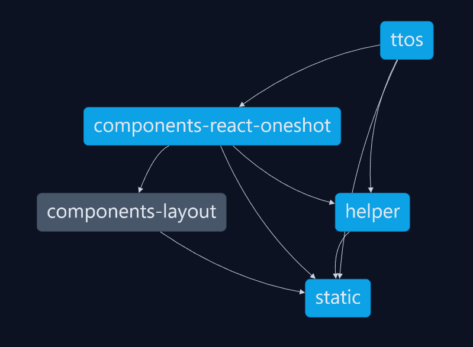

# Quickshot
A tabletop one shot generator
[Demo](https://tabletop-one-shot.vercel.app/)

## Prompt Template Engineering
Prompt engineering is the process of designing prompts that can be used to generate specific types of text from a language model. In the context of this project, prompt engineering is used to generate one-shot tabletop roleplaying game (TTRPG) adventures

We can think of prompt templates like a text document that a software engineers wrote, often adding in end-user text to one or more parts of the document, then sending the whole document off to a large language model (LLM), which continues writing the document where the prompt engineer left off. The software engineer then takes what the LLM generated and uses that in their application

This can be as simple as requesting it generate a short phrase ([name](apps/ttos/app/api/llm/name/route.ts)), generating text that _appears_ to be a chat log ([chat](apps/ttos/app/api/llm/chat/route.ts)), or even returning a well-formatted JSON document by using an output parser ([overview](apps/ttos/app/api/llm/overview/route.ts) & [stats](apps/ttos/app/api/llm/stats/route.ts))

## Services
|  Service                                                                     | Role                                           |
|----                                                                          |----                                            |
|  [Gemini 1.5 Pro](https://aistudio.google.com/)                              | LLM Inference service (AI text generation)     |
|  [LangChain JS](https://js.langchain.com/docs/get_started/introduction)      | LLM Application Framework                      |
|  [Vercel](https://vercel.com/)                                               | Site hosting                                   |
|  [Nx.dev](https://nx.dev/)                                                   | Monorepo build and development tool            |
|  [Next.js](https://nextjs.org/)                                              | React server framework                         |
|  [Google oAuth2](https://developers.google.com/identity/protocols/oauth2)    | Authentication and authorization service       |
|  [PostgreSQL](https://www.postgresql.org/)                                   | Database                                       |

## Local dev setup
1. `npm i`
2. `nx serve ttos`
3. Get an API key from [Google MakerSuite (AI Studio)](https://aistudio.google.com/)
3. Create `.env` at base of repository and set its contents to `GOOGLE_API_KEY=YOUR KEY`

_Note: Authorization and DB won't work until you set all keys from [.env-example](./.env-example)_

### Monorepo Packages
This project is built using internal packages (monorepo), powered by [Nx](https://nx.dev).

#### Application Package
- [/apps/ttos](/apps/ttos) Main web application, wrote in [NextJS](https://nextjs.org/docs) (v13's app router style). Contains React [Page](/apps/ttos/app/) component(s) and [API](/apps/ttos/app/api/) routes.

#### Library Packages
- [@components-layout](/libs/components-layout) Custom React component library. Contains highly reusable React **Non-Page styling** components.
- [@components-react-oneshot](/libs/components-react-oneshot) Custom React components unique to our one-shot application. Contains highly reusable React **Non-Page** components.
- [@helper](/libs/helper) Various helper functions for both client and server
- [@static](/libs/static) Various standard and app-specific static data variables
